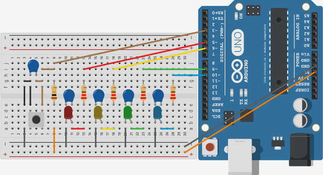

# Getting Started with Arduino

This project demonstrates how to use Arduino starter kit to implement fairy lights. The project is divided into stages, each stage reasonably complicates the previous one - from the simplest blinky program up to the complex 4-mode 4-color prototype.

For this project Arduino 1.6.6 has been used. Program code has been tested using online electronics lab at [circuits.io](https://123d.circuits.io).

Test board for the final stage looks as on the picture below.

Original test board model was at [Autodesk Circuits](https://123d.circuits.io/circuits/1190100-72-is_vvv_4s-2015_hwprog), but as for now (2017/11/23) it seems to be obsolete (requires project migration to Tinkercad).
